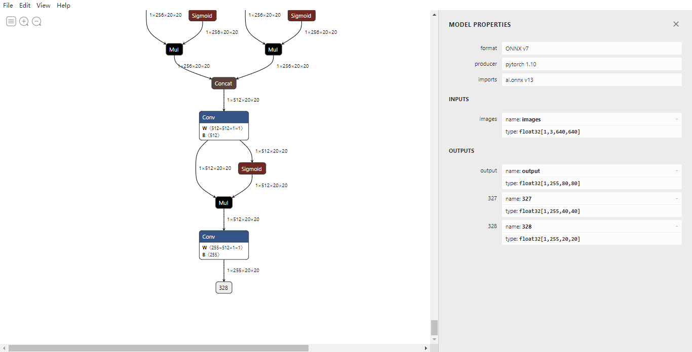
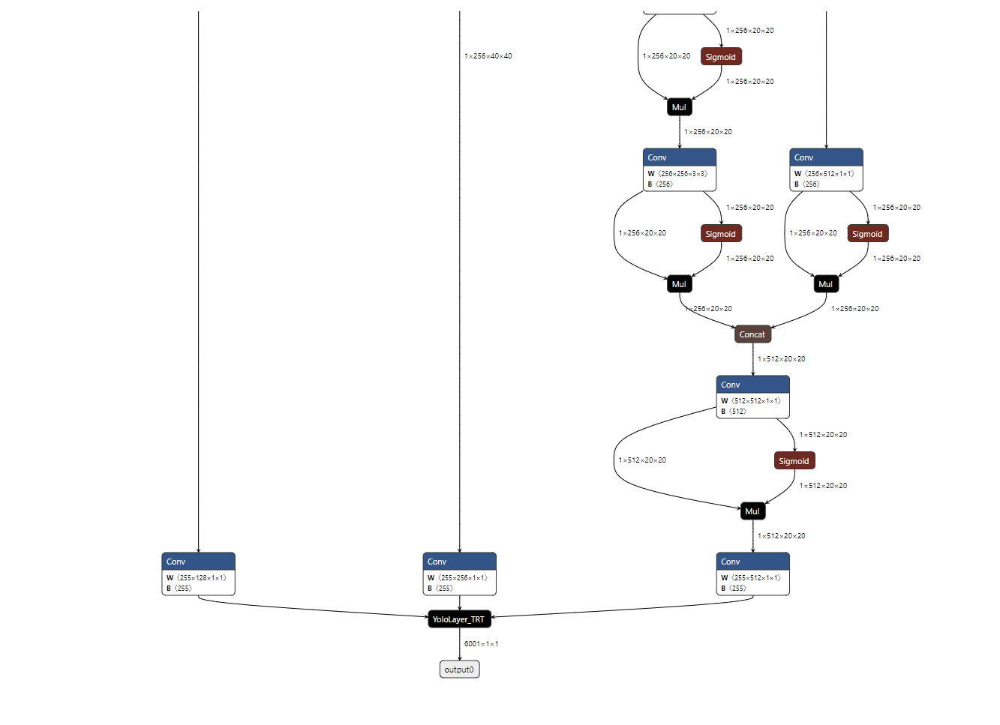

<!--

 * @Description: YOLOv5 TensorRT
 * @Author: nanmi
 * @Date: 2021-11-22 16:55:35
 * @LastEditTime: 2021-11-22 16:55:35
 * @LastEditors: nanmi
 * @GitHub:github.com/nanmi
   -->

# A Special YOLOv5s6.0 Deploy TensorRT :two_hearts: :collision:

This project base on https://github.com/ultralytics/yolov5/tree/v6.0


# News

Deploy yolov5{all version s-l;3.0-6.0} to TensorRT 8.0, FPS>200 - 2021-7-21

# System Requirements

cuda 11.4

TensorRT 8+

OpenCV 4.0+ (build with opencv-contrib module) [how to build](https://gist.github.com/nanmi/c5cc1753ed98d7e3482031fc379a3f3d#%E6%BA%90%E7%A0%81%E7%BC%96%E8%AF%91gpu%E7%89%88opencv)

# Installation

Make sure you had install dependencies list above

```bash
# clone project and submodule
git clone {this repo} --recursive

cd {this repo}/

```

# Modify yolov5

1.Modify yolov5 output layer when export onnx model.

in `yolov5/models/yolo.py` line 54,add this code

```python
    def forward(self, x):
        z = []  # inference output
        self.training |= self.onnx_dynamic  #<------NOTE: This is code that I add.
        for i in range(self.nl):
            x[i] = self.m[i](x[i])  # conv
            if not self.onnx_dynamic:  # inference  <------NOTE: This is code that I add.
                bs, _, ny, nx = x[i].shape  # x(bs,255,20,20) to x(bs,3,20,20,85)
                x[i] = x[i].view(bs, self.na, self.no, ny, nx).permute(0, 1, 3, 4, 2).contiguous()

            if not self.training:  # inference
                if self.grid[i].shape[2:4] != x[i].shape[2:4] or self.onnx_dynamic:
                    self.grid[i], self.anchor_grid[i] = self._make_grid(nx, ny, i)
                y = x[i].sigmoid()
                if self.inplace:
                    y[..., 0:2] = (y[..., 0:2] * 2. - 0.5 + self.grid[i]) * self.stride[i]  # xy
                    y[..., 2:4] = (y[..., 2:4] * 2) ** 2 * self.anchor_grid[i]  # wh
                else:  # for YOLOv5 on AWS Inferentia https://github.com/ultralytics/yolov5/pull/2953
                    xy = (y[..., 0:2] * 2. - 0.5 + self.grid[i]) * self.stride[i]  # xy
                    wh = (y[..., 2:4] * 2) ** 2 * self.anchor_grid[i]  # wh
                    y = torch.cat((xy, wh, y[..., 4:]), -1)
                z.append(y.view(bs, -1, self.no))

        return x if self.training else (torch.cat(z, 1), x)
```

in `yolov5/export.py` before `torch.onnx.export` add this code 

```python
model.model[-1].onnx_dynamic = True
```


### export onnx model

```python
python export.py --data data/coco128.yaml --weights ../checkpoint/yolov5s.pt
```

# simplifier

```python
python -m onnxsim yolov5s.onnx yolov5s-sim.onnx
```



currently this mode has one input and three outputs(output, 327, 328)


# Add yolo layer custom op(post process)
use this repo's script `add_custom_yolo_op.py`

### Add custom op

```shell
cd script
python add_custom_yolo_op.py
```

show yolov5s-yolo-op.onnx




# Build yolo layer tensorrt plugin

```shell
cd {this repo}/YoloLayer_TRT_v6.0
mkdir build && cd build
cmake .. && make

```

generate `libyolo.so` when build successfully.

# Build TensorRT engine

```shell
cd {this repo}/

trtexec  --onnx={this repo}/checkpoint/yolov5s-yolo-op.onnx --workspace=10240 --fp16 --saveEngine=yolo.engine --plugins={this repo}/YoloLayer_TRT_v6.0/build/libyolo.so
```

wait a long time :satisfied:

TensorRT engine is generated successfully.


# Inference

```shell
cd {this repo}/yolov5s-6.0-tensorrt/
mkdir build && cd build
cmake .. && make 

# Inference test
cd {this repo}/yolov5s-6.0-tensorrt/build/
./yolov5 -d {your build engine} ../images
```


# About License

For the 3rd-party module and Deepstream, you need to follow their license

For the part I wrote, you can do anything you want

